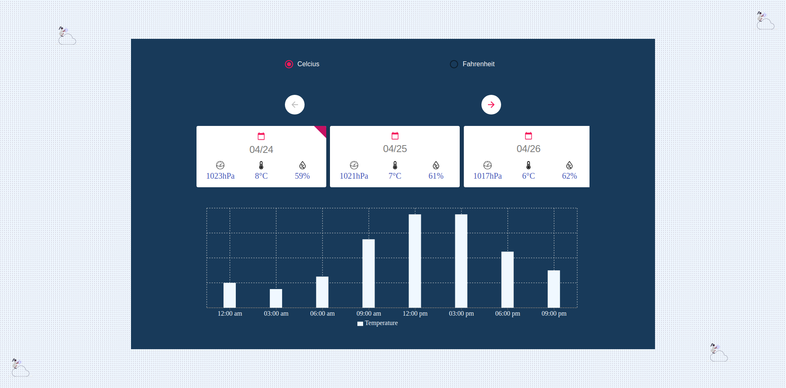
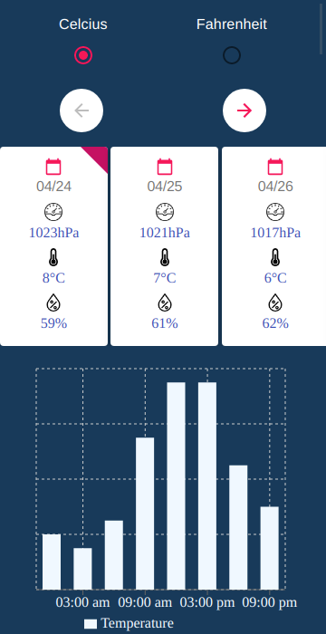

# 💻 Weather APP (React)


<p align="center">

</p>
A **weather App** that displays weather info for the city of Munich

### main features

- Weather info for the next 5 days (40 segments)
- A Barchart that showcases the evolution of the temperature through a given day. Updatable upon selecting on a different card
- Clickable cards that display the date, average pressure, average temperature, and average humidity
- A checkboxes switch that converts all the displayed temperature values from or to Fahrenheit or Celcius

### Technologies Used

In this app we used the following technologies:

HTML | CSS(SASS) | Javascript | React | Redux 
------------ | ------------- | ----------- | ----------- | -----------
 |  |  |  | 


## ✨ Live Demo

You can look at it [here](https://proto-dashboard.netlify.com/)

## 🚀 Getting Started

To get a local copy up and running follow these simple example steps.

### Clone

```sh
git git@github.com:stratospherique/weather-app-react.git
cd weather-app-react
```

### Install

```sh
npm install
```

### Usage

```sh
npm start
```

### Tests (Unit Test)
- Helpers: `yarn test-helpers`
- Reducers: `yarn test-reducers`
- Actions: `yarn test-actions`

### Todo :pencil:
- Add dialog to select city/country(location)

## Author

:male_detective: Ahmed Mahfoudh

- [Github](https://github.com/stratospherique)
- [Linkedin](https://www.linkedin.com/in/ahmed-mahfoudh/)
- [Twitter](https://twitter.com/AhmedMahfoudh8)
- [Email](mailto:ahmed.mahfoudh1991@gmail.com?subject=Website%20Inquiry)

## 🤝 Contributing

Contributions, issues and feature requests are welcome!

Feel free to check the [issues page](issues/).

## Show your support

Give a ⭐️ if you like this project!

> “There is no exercise better for the heart than reaching down and lifting people up.” 
John Holmes